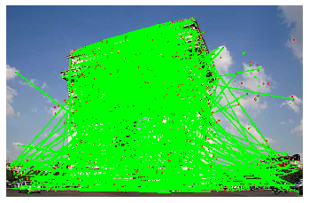

# Computer Vision Assignment 1
**Michael Shepherd - 19059019**
## Question 1


```python
display_1()
```


To answer this question, I created a boolean mask to denote where the green value of a pixel was greater than 175 or the green value was bigger than either the blue or red value. I the created a new empty image on which I projected the greenscreen image where green was false and a new image where green was true. After some testing, I decided that this threshold was the best that I would find as it removes most of the greenscreen while still keeping most of the people infront of the greenscreen. Any difference in the threshold would either remove the shoulder of the woman or increase the amount of greenscreen left over.

## Question 2


```python
display_2()
```

    Original picture:


    Smoothed with Gaussian filter:


    Mask:


    Final Result Truncated:


    Final Result Scaled:


    Final Result Clipped:


To answer this question, I first created a blurred version of the original image. I then used this image to create a mask that was then added to the original image to sharpen the image. I then displayed the image with three different techniques of keeping the intensity values between 0 and 255.

From the above results, we can clearly see that simply truncating the values outside of the interval will lead to imperfections in the result due to intenities being on the complete opposite of the spectrum that they are supposed to be. Scaling the result leads to a much more clean image, but since we are adding, scaling the image will result in a lower intensity for all of the scaled values in the result. I found that clipping the values into the uint8 range lead to a much clearer image that was far more true to the original image's intensities.

## Question 3

### Nearest Neighbour


```python
cat_nn = display_3_nn()
```

    Scale = 3.1
    Starting Nearest Neighbour
    Done resizing


    Scale = 5
    Starting Nearest Neighbour
    Done resizing


    Scale = 0.9
    Starting Nearest Neighbour
    Done resizing


    Scale = 0.1
    Starting Nearest Neighbour
    Done resizing


### Bilinear Interpolation


```python
cat_bl = display_3_bl()
```

    Scale = 3.1
    Starting Bilinear Interpolation
    Done resizing


    Scale = 5
    Starting Bilinear Interpolation
    Done resizing


    Scale = 0.9
    Starting Bilinear Interpolation
    Done resizing


    Scale = 0.1
    Starting Bilinear Interpolation
    Done resizing


### Comparison
To compare how the two methods of interpolation result in very different final images, we will take the eyeball of this cat after being scaled by x3.1.


```python
compare_nn_bl()
```

    Nearest Neighbour Interpolation:


    Bilinear Interpolation:


    Open CV resize:


From the above comparissons, we can see that the nearest neighbour interpolation creates a far more general impression of a neighbourhood than the bilinear interpolation. This means that bilinear interpolation gives us a far better quality of image with more detail. We can see that the built in OpenCV resizing algorithm returns a result that is far closer to the bilinear interpolation result than the nearest neighbour interpolation. This is most likely because the OpenCV algotithm and bilinear interpolation both take the position of the inverse pixel far more seriously than nearest neighbour interpolation, which results in different values for most pixels in a neighbourhood, rather than clumping a neighbourhood as a single colour.

## Question 4a


I have chosen to use the python OpenCV library to answer this question.

### (1)
first I created a function that returns an image, its feature coordinates as keypoints and the descriptors using the cv2 detectAndCompute function. This function requires the chosen feature detector algorithm and the image to be analysed. This allowed me to test different detector algorithms.

### (2)
I then created functions to find and draw the feature vectors between two input images, using a given feature detector algorithm.


For ORB I used a brute force matcher using NORM_HAMMING for the norm, and True crossCheck, as is recomended by the OpenCV documentation. Such technique usually produces best results with minimal number of outliers when there are enough matches.

These are the resources from the OpenCV documenation that I used to learn about about ORB and how to use it:

https://docs.opencv.org/3.0-beta/doc/py_tutorials/py_feature2d/py_orb/py_orb.html#orb
https://docs.opencv.org/3.4.2/d5/dde/tutorial_feature_description.html

For SURF I used BruteForce-L2 for the descriptor matcher type and set the hessian threshold at 400 to start with as was suggested by the examples in the OpenCV documentation.

These are the resources from the OpenCV documenation that I used to learn about about SURF and how to use it:

https://docs.opencv.org/3.0-beta/doc/py_tutorials/py_feature2d/py_surf_intro/py_surf_intro.html#surf
https://docs.opencv.org/trunk/dc/dc3/tutorial_py_matcher.html

## Question 4b
I then tested my program with various different algorithms in inputs to find the best and most correct possible result.


```python
display_4_2()
```

    SURF, min hessian = 400
    Matching features: 2182


    ORB
    Matching features: 292


Above we can see, in the 300 closest matches (by distance between points on semper0), that in the SURF example, there are far more matches than in the ORB example. More importantly there are far more matches that look as if they are correct. It is for that reason that I chose the SURF algorithm.


```python
change_hessian(1000)
```

    SURF, min hessian = 400
    Matching features: 2182


    SURF, min hessian = 300
    Matching features: 2588


    SURF, min hessian = 200
    Matching features: 3240


    SURF, min hessian = 100
    Matching features: 4280


    SURF, min hessian = 50
    Matching features: 5006


In the above examples, I have decremented the hessian threshold to try and find a point where incorrect matches start to appear. to illustrate this I have drawn the first 1000 matching feature vectors that have the shortest distance between the two images.

It is clear that 400 is too high of a threshold, but there is no clear improvement when the threshold is lower than 100. I have therefore chosen the hessian threshold as 100.

## Question 5

To answer this question, I used the OpenCV built in resizing algorithm to create 13 differently scaled images between 0.1 and 3.0. I then ran my program on them to test its robustness.


```python
accuracy_list, repeatability_list, scales = display_5()
```

    Resizing:


    1% distance threshold: 6.4
    Matching features: 6
    Correct Matches: 2
    Scale: 0.1
    Repeatability:0.26490066225165565%
    Accuracy: 33.33333333333333%
    **************


    1% distance threshold: 6.4
    Matching features: 84
    Correct Matches: 30
    Scale: 0.2
    Repeatability:3.708609271523179%
    Accuracy: 35.714285714285715%
    **************


    1% distance threshold: 6.4
    Matching features: 228
    Correct Matches: 100
    Scale: 0.30000000000000004
    Repeatability:10.066225165562914%
    Accuracy: 43.859649122807014%
    **************


    1% distance threshold: 6.4
    Matching features: 409
    Correct Matches: 197
    Scale: 0.4
    Repeatability:18.05739514348786%
    Accuracy: 48.16625916870416%
    **************


    1% distance threshold: 6.4
    Matching features: 571
    Correct Matches: 363
    Scale: 0.5
    Repeatability:25.20971302428256%
    Accuracy: 63.57267950963222%
    **************


    1% distance threshold: 6.4
    Matching features: 896
    Correct Matches: 422
    Scale: 0.6
    Repeatability:39.558498896247244%
    Accuracy: 47.098214285714285%
    **************


    1% distance threshold: 6.4
    Matching features: 1128
    Correct Matches: 647
    Scale: 0.7000000000000001
    Repeatability:49.80132450331126%
    Accuracy: 57.35815602836879%
    **************


    1% distance threshold: 6.4
    Matching features: 1417
    Correct Matches: 765
    Scale: 0.8
    Repeatability:62.56070640176601%
    Accuracy: 53.98729710656316%
    **************


    1% distance threshold: 6.4
    Matching features: 1767
    Correct Matches: 1021
    Scale: 0.9
    Repeatability:78.01324503311258%
    Accuracy: 57.7815506508206%
    **************


    1% distance threshold: 6.4
    Matching features: 2265
    Correct Matches: 2265
    Scale: 1.0
    Repeatability:100.0%
    Accuracy: 100.0%
    **************


    1% distance threshold: 6.4
    Matching features: 2224
    Correct Matches: 1291
    Scale: 1.1
    Repeatability:98.18984547461369%
    Accuracy: 58.048561151079134%
    **************


    1% distance threshold: 6.4
    Matching features: 2265
    Correct Matches: 1198
    Scale: 1.2000000000000002
    Repeatability:100.0%
    Accuracy: 52.89183222958057%
    **************


    1% distance threshold: 6.4
    Matching features: 2265
    Correct Matches: 1234
    Scale: 1.3000000000000003
    Repeatability:100.0%
    Accuracy: 54.48123620309051%
    **************


    1% distance threshold: 6.4
    Matching features: 2265
    Correct Matches: 1264
    Scale: 1.4000000000000001
    Repeatability:100.0%
    Accuracy: 55.80573951434879%
    **************


    1% distance threshold: 6.4
    Matching features: 2265
    Correct Matches: 1240
    Scale: 1.5000000000000002
    Repeatability:100.0%
    Accuracy: 54.746136865342166%
    **************


    1% distance threshold: 6.4
    Matching features: 2265
    Correct Matches: 1204
    Scale: 1.6
    Repeatability:100.0%
    Accuracy: 53.15673289183223%
    **************


    1% distance threshold: 6.4
    Matching features: 2265
    Correct Matches: 1158
    Scale: 1.7000000000000002
    Repeatability:100.0%
    Accuracy: 51.12582781456953%
    **************


    1% distance threshold: 6.4
    Matching features: 2265
    Correct Matches: 1153
    Scale: 1.8000000000000003
    Repeatability:100.0%
    Accuracy: 50.905077262693155%
    **************


    1% distance threshold: 6.4
    Matching features: 2265
    Correct Matches: 1297
    Scale: 1.9000000000000001
    Repeatability:100.0%
    Accuracy: 57.262693156732894%
    **************


    1% distance threshold: 6.4
    Matching features: 2265
    Correct Matches: 1443
    Scale: 2.0
    Repeatability:100.0%
    Accuracy: 63.70860927152317%
    **************


    1% distance threshold: 6.4
    Matching features: 2265
    Correct Matches: 1286
    Scale: 2.1
    Repeatability:100.0%
    Accuracy: 56.77704194260485%
    **************





    1% distance threshold: 6.4
    Matching features: 2265
    Correct Matches: 1142
    Scale: 2.2
    Repeatability:100.0%
    Accuracy: 50.41942604856512%
    **************


    1% distance threshold: 6.4
    Matching features: 2265
    Correct Matches: 1081
    Scale: 2.3000000000000003
    Repeatability:100.0%
    Accuracy: 47.726269315673285%
    **************


    1% distance threshold: 6.4
    Matching features: 2265
    Correct Matches: 1078
    Scale: 2.4000000000000004
    Repeatability:100.0%
    Accuracy: 47.59381898454746%
    **************


    1% distance threshold: 6.4
    Matching features: 2265
    Correct Matches: 1148
    Scale: 2.5000000000000004
    Repeatability:100.0%
    Accuracy: 50.68432671081678%
    **************


    1% distance threshold: 6.4
    Matching features: 2265
    Correct Matches: 1204
    Scale: 2.6
    Repeatability:100.0%
    Accuracy: 53.15673289183223%
    **************


    1% distance threshold: 6.4
    Matching features: 2265
    Correct Matches: 1226
    Scale: 2.7
    Repeatability:100.0%
    Accuracy: 54.128035320088294%
    **************


    1% distance threshold: 6.4
    Matching features: 2265
    Correct Matches: 1217
    Scale: 2.8000000000000003
    Repeatability:100.0%
    Accuracy: 53.73068432671082%
    **************


    1% distance threshold: 6.4
    Matching features: 2265
    Correct Matches: 1265
    Scale: 2.9000000000000004
    Repeatability:100.0%
    Accuracy: 55.84988962472406%
    **************


    1% distance threshold: 6.4
    Matching features: 2265
    Correct Matches: 1251
    Scale: 3.0000000000000004
    Repeatability:100.0%
    Accuracy: 55.2317880794702%
    **************


```python
plot_5()
```


From the above experiment, we can see that the repeatability of the matching is very low on the smaller images. This is due to the fact that with fewer pixels, the algorithm will struggle to find as many feature points to match with feature points in the original image. We can see that as the scale increases, the repeatability increases and finally flatlines at 100%. This is due to the fact that at larger scales there are far more features to be found in images due to the much larger amount of detail created by the larger pixel count. Eventually there are more features being found in the scaled images than the original image, which leads to there always being a match for every feature in the original image, even if the matches are not exactly correct.


The accuracy of the algorithm reacts completely differently to the repeatability. At the lower scales, we can see that the accuracy is tiny, which is expected due to so much detail being lost when the original image is scaled. After the feature detection alogorithms are able to find enough feature points to make real comparissions the accuracy (which was allowed 1% leeway) is consistantly in the range of 45%-65%.


These results look like this because this particular implementation is looking for as many feature matches as it can possibly find, regardless of the positioning. this is necessary as it increases the repeatability for when we are trying to find how an image has moved between two images, but for comparing scaled images it results in a fairly poor accuracy rate. It is possible to only match features that are correct, but this would only make the accuracy better for scaled images and would decrease the repeatability. Thsi solution would also make it compeletely useless for detecting if an picture was taken from a different angle.
